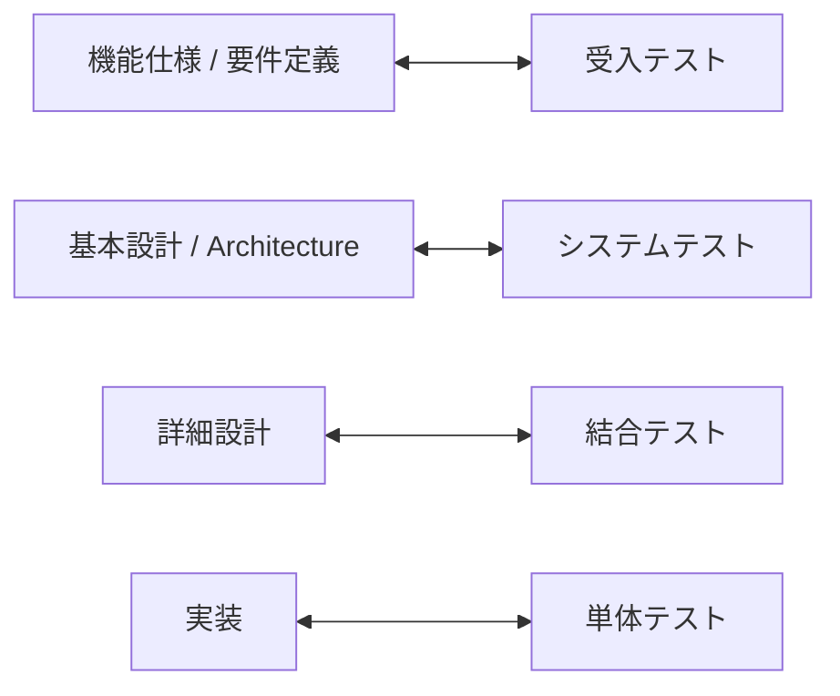
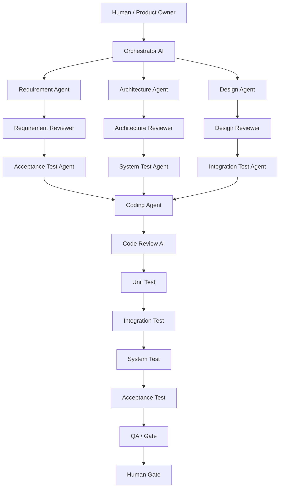
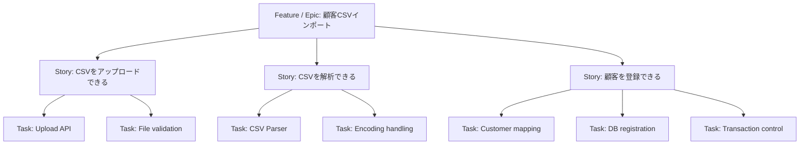
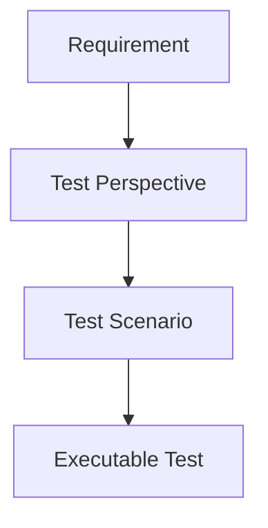
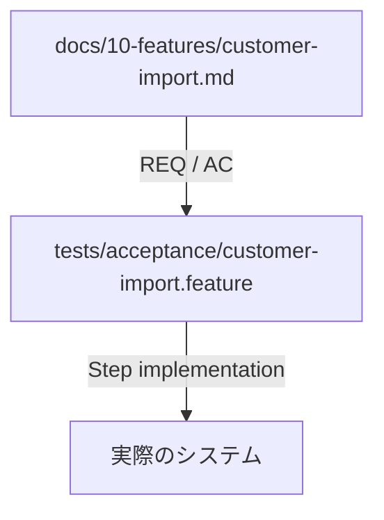
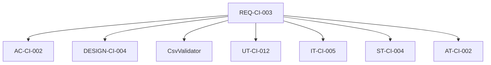
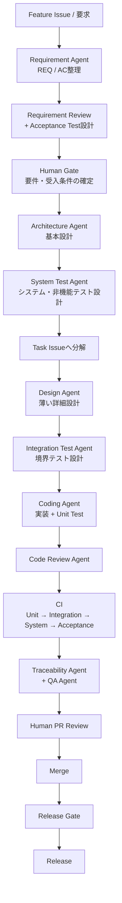
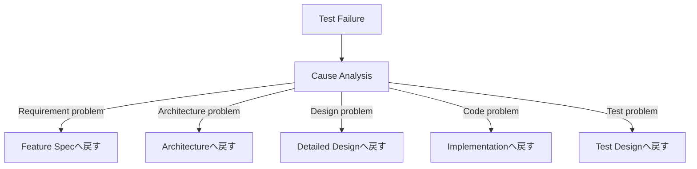
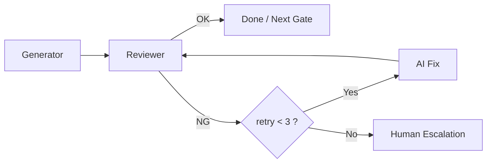
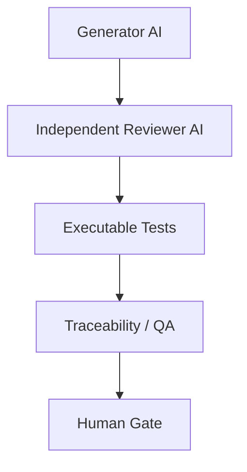

# AIエージェント × Wモデル 開発プロセス設計レポート

> 仕様・設計・実装・テストをAIで相互検証するための実運用設計

> **本レポートの目的**
>
> WモデルをAIエージェントによるシステム開発へ適用するために、Issueの粒度、仕様書の分割方針、詳細設計の位置付け、ドキュメント構成、テスト設計、BDD/.featureの活用方法を一貫した形で整理する。

**推奨方針: 要件は厚め / 詳細設計は薄く / コードとテストは厚く**

> **Mermaidについて**
>
> フローや関係図は、GitHubなどMermaid対応のMarkdownビューアでそのまま描画できるよう `mermaid` コードブロックで記述している。ディレクトリ構成や仕様例など、テキストの方が読みやすいものはコードブロックのままとする。

# エグゼクティブサマリー

- AIにコードを書かせるだけではなく、各工程の成果物を別のAIが検証する構造にする。

- Wモデルの左側と右側を「機能仕様 ↔ 受入テスト」「基本設計 ↔ システムテスト」「詳細設計 ↔ 結合テスト」「コード ↔ 単体テスト」と対応付ける。

- 機能単位のIssueはAI実行単位としては大きすぎることが多い。Feature/Storyを親にし、AIが処理するTask Issueは1 PRで完結する小さな縦切り単位にする。

- 仕様書は機能ごとに分割し、横断ルールは共通仕様へ分離する。Issueと仕様書を1対1にしない。

- 詳細設計はコードの日本語化ではなく、実装AIと結合テストAIが共有する「薄い契約」として残す。

- docs/50-test/はテストコードのコピーではなく、テスト方針・観点・期待結果を管理する。実行可能テストはtests/側に置く。

- 受入テストはBDD/Gherkinの.featureを活用すると、仕様から実行可能テストまで自然につなげられる。

- REQ/AC/設計/コード/テストをIDで追跡し、Traceability Agentに欠落を検出させる。

> **最重要原則**
>
> AIが生成した成果物を、同じAIの自己評価だけで「正しい」としない。Generator / Reviewer / Test / Human Gateを分離し、相互検証する。

# 1. Wモデルの基本

Wモデルは、開発工程が終わってからテストを考えるのではなく、各開発工程と同時に、それを検証するテスト活動を設計する考え方である。



| **開発成果物**         | **対応する検証** | **主な確認内容**                       |
|------------------------|------------------|----------------------------------------|
| 機能仕様・要件         | 受入テスト       | 利用者の要求・業務ルールを満たすか     |
| 基本設計・Architecture | システムテスト   | システム全体・非機能要件を満たすか     |
| 詳細設計               | 結合テスト       | コンポーネント間の契約・境界が正しいか |
| 実装コード             | 単体テスト       | 局所ロジックが正しく動くか             |

AI開発における価値は、テストの前倒しだけではない。仕様作成AIとテスト設計AIを分離すると、仕様の曖昧さや不足を実装前に発見しやすくなる。

# 2. AIでWモデルを回す基本設計



## 2.1 エージェントの役割

| **Agent**              | **責務**                             | **主な成果物**         |
|------------------------|--------------------------------------|------------------------|
| Requirement Agent      | 要求を要件・受入条件へ整理           | feature仕様 / REQ / AC |
| Requirement Reviewer   | 曖昧性、矛盾、不足、非機能要件を検出 | レビュー指摘           |
| Acceptance Test Agent  | REQ/ACから受入シナリオを作成         | .feature / 受入観点    |
| Architecture Agent     | システム構成と制約を設計             | architecture docs      |
| System Test Agent      | システム・非機能テスト観点を作成     | system test docs       |
| Design Agent           | IF、責務、シーケンス、例外などを設計 | thin detailed design   |
| Integration Test Agent | コンポーネント境界を検証             | integration scenarios  |
| Coding Agent           | 設計に基づいて実装                   | source code            |
| Code Review Agent      | 仕様・設計・規約・安全性を確認       | review result          |
| Traceability Agent     | REQからテストまでの欠落を検出        | traceability report    |
| QA Agent               | 全体の品質ゲートを判定               | QA report              |

## 2.2 Human-in-the-Loop

人間はすべてのAI成果物を逐一確認するのではなく、意思決定が必要な地点に絞る。

- 要件・受入条件の確定

- 重要なArchitecture判断の確定

- PRのMerge

- Release承認

# 3. Issueの粒度設計

「機能単位のIssueをそのままAIへ渡す」方式は、実装範囲が広くなりやすく、AIのコンテキスト・レビュー・再実行のコストが増える。そのため管理単位とAI実行単位を分離する。



## 3.1 推奨するTask Issueの条件

- 目的を1〜2文で説明できる。

- Acceptance Criteriaが概ね3〜7個に収まる。

- 変更対象が限定される。

- 1つのPRで完結する。

- 単体テストを独立して作れる。

- 他Taskとの依存関係を明示できる。

> **縦切りを優先**
>
> 「要件Issue」「設計Issue」「実装Issue」と工程ごとに横切りするより、小さな機能スライスの中にDesign / Implementation / Testを含める方が、AIが目的を見失いにくい。

# 4. 仕様書ファイルの分割方針

仕様書は基本的に機能単位で分ける。ただし1 Issue = 1仕様書にはせず、長期的な「仕様の正」と、短期的な「変更作業」を分離する。

```text
docs/
+-- features/
| +-- customer-import.md
| +-- customer-search.md
| +-- customer-update.md
|
+-- common/
| +-- authentication.md
| +-- authorization.md
| +-- error-handling.md
| +-- logging.md
| +-- transaction.md
| +-- validation.md
```

| **対象**     | **役割**             | **原則**                  |
|--------------|----------------------|---------------------------|
| Feature Spec | What / Ruleを定義    | 機能仕様のSSOT            |
| Common Spec  | 横断ルールを定義     | 各Featureで重複記載しない |
| GitHub Issue | 変更・作業内容を定義 | 仕様書を参照する          |
| Code         | Implementation       | 詳細実装のSSOT            |

## 4.1 Feature仕様の例

```text
# Customer Import

## Purpose
CSVから顧客を一括登録する。

## Requirements
REQ-CI-001: CSVファイルをアップロードできる。
REQ-CI-002: 正常なレコードを顧客として登録できる。
REQ-CI-003: 不正レコードが存在する場合は登録しない。

## Acceptance Criteria
AC-CI-001: 正常なCSVの場合、全件登録される。
AC-CI-002: 必須項目不足の場合、エラーになる。

## Business Rules
- customer_id は必須
- email は有効な形式
- customer_id の重複は禁止

## References
- ../common/error-handling.md
- ../common/transaction.md
```

# 5. AIに詳細設計書を書かせる意味

詳細設計書は有用だが、コードを日本語へ変換しただけの文書にはしない。AI開発では「実装AIと結合テストAIが独立して同じ仕様を解釈できる契約」として位置付ける。

| **残す価値が高い情報**   | **価値が低い情報**             |
|--------------------------|--------------------------------|
| API入出力・エラー仕様    | メソッド内部処理の逐語説明     |
| コンポーネント責務       | コードと同じif/for処理の説明   |
| 外部IF・依存関係         | 変数名レベルの説明             |
| 状態遷移・重要シーケンス | コードを見れば自明な処理フロー |
| トランザクション境界     | 実装後に自動生成しただけの説明 |
| 例外・リトライ方針       | 実装と二重管理になる詳細       |

## 5.1 薄い詳細設計の例

```text
## CsvImportService

責務:
CSVの解析結果を顧客登録処理へ渡す。

Input:
CsvFile

Output:
ImportResult

Dependencies:
- CsvParser
- CsvValidator
- CustomerRepository

Transaction:
1ファイル単位。1件でも失敗した場合は全件rollback。

Errors:
- InvalidCsvFormat
- ValidationError
- DuplicateCustomer

Sequence:
CsvImportService -> CsvParser -> CsvValidator -> CustomerRepository
```

重要な設計判断と理由は詳細設計へ埋め込まず、ADR (Architecture Decision Record) として分離する。

# 6. 推奨ドキュメント構成

```text
docs/
+-- 00-overview/
| +-- system-overview.md
| +-- glossary.md
| +-- context-map.md
|
+-- 10-features/
| +-- customer-import.md
| +-- customer-search.md
|
+-- 20-common/
| +-- authentication.md
| +-- authorization.md
| +-- error-handling.md
| +-- logging.md
| +-- transaction.md
|
+-- 30-architecture/
| +-- architecture-overview.md
| +-- component-model.md
| +-- data-model.md
| +-- external-systems.md
| +-- deployment.md
|
+-- 40-design/
| +-- customer-import/
| +-- interface.md
| +-- sequence.md
| +-- data-flow.md
|
+-- 50-test/
| +-- README.md
| +-- test-policy.md
| +-- acceptance/
| +-- system/
| +-- integration/
| +-- test-data/
|
+-- 60-adr/
| +-- ADR-001-transaction-boundary.md
|
+-- 90-traceability/
+-- traceability.md
```

> **SSOTの考え方**
>
> features/*.md = 機能仕様の正、ADR = 重要な設計判断の正、code + tests = 詳細実装と実行可能な検証の正、と役割を明確にする。

# 7. docs/50-test/ の詳細設計

docs/50-test/は「テストケースを大量に書く場所」ではなく、どう品質を確認するかを定義する場所とする。実行可能テストはtests/側に置き、二重管理を避ける。

```text
docs/50-test/
+-- README.md
+-- test-policy.md
+-- acceptance/
| +-- customer-import.md # 必要な場合のみ
+-- system/
| +-- customer-import.md
| +-- performance.md
| +-- security.md
| +-- recovery.md
+-- integration/
| +-- customer-import.md
+-- test-data/
+-- policy.md

tests/
+-- unit/
+-- integration/
+-- system/
+-- acceptance/
```

## 7.1 README.md

テストドキュメント全体の入口。Wモデル上の対応、各ディレクトリの責務、実行可能テストの置き場所を明示する。

## 7.2 test-policy.md

- Unit / Integration / System / Acceptanceの責務と境界

- 自動化方針

- Mock / Stubの利用方針

- カバレッジや品質ゲート

- テストデータの基本ルール

- 再現性・独立性・失敗時の診断方針

## 7.3 acceptance/

Feature仕様・REQ/ACを検証する。BDDを採用する場合は、Markdownで同じケースを重複管理せず、.featureを実行可能な受入仕様として利用する。

## 7.4 system/

Architectureと非機能要件を検証する。機能単位だけでなく、performance / security / recoveryなど横断的なテスト観点を置く。

## 7.5 integration/

詳細設計のコンポーネント境界、DB、外部Adapter、トランザクション、例外伝播などを検証する。

## 7.6 Unit Test

原則としてdocs/50-test/unit/は作らず、tests/unit/のテストコード自体を詳細仕様として扱う。Markdownとテストコードの二重管理を避ける。

## 7.7 Test Perspectiveを先に作る

AIに具体的テストケースをいきなり生成させるのではなく、まずテスト観点を抽出させ、その後にシナリオと実行可能テストへ落とす。



- Input: 空、0 byte、最大サイズ、上限超過

- Boundary: 0件、1件、最大件数

- Format: 文字コード、BOM、不正文字

- Business Rule: 必須、重複、形式不正

- Failure: DB障害、timeout、rollback

# 8. BDDと.feature

BDD (Behavior-Driven Development) は、システムの「振る舞い」を業務の言葉で記述し、開発者・テスト担当・利用者の共通理解を作る考え方である。Gherkin形式で記述したファイルが .feature である。

| **Keyword** | **意味**                 |
|-------------|--------------------------|
| Feature     | 対象となる機能           |
| Scenario    | 具体的な振る舞い・ケース |
| Given       | 前提条件                 |
| When        | 操作・イベント           |
| Then        | 期待結果                 |
| And         | 条件や期待結果の追加     |

## 8.1 .featureの例

```gherkin
Feature: 顧客CSVインポート

  Scenario: 正常なCSVをアップロードする
    Given 正常な顧客CSVが存在する
    When CSVをアップロードする
    Then すべての顧客が登録される

  Scenario: customer_idがないCSVをアップロードする
    Given customer_idが欠落したCSVが存在する
    When CSVをアップロードする
    Then エラーが返される
    And 顧客データは登録されない
```

Pythonではbehaveやpytest-bddなどを使い、Given/When/Thenを実際のテスト処理へ対応付けられる。これにより受入仕様と自動テストを近づけられる。



# 9. トレーサビリティ設計

AI開発では「どの要件を、どの設計・コード・テストが担保しているか」をIDで追跡できるようにする。



| **Requirement** | **Design**   | **Code**         | **UT** | **IT** | **ST** | **AT** |
|-----------------|--------------|------------------|--------|--------|--------|--------|
| REQ-CI-001      | interface.md | Controller       | UT-101 | IT-101 | ST-101 | AT-101 |
| REQ-CI-002      | sequence.md  | CsvImportService | UT-102 | IT-102 | ST-102 | AT-102 |
| REQ-CI-003      | sequence.md  | CsvValidator     | UT-103 | IT-103 | ST-103 | AT-103 |

Traceability Agentは、要件に対する設計・コード・テストの未作成、不要な実装、変更後の追随漏れなどを検出する。人間が表を手作業で維持する運用は避け、自動生成・自動更新を基本とする。

# 10. 推奨するエンドツーエンド開発フロー



1.  Feature Issueまたは要求を起点にRequirement AgentがREQ/ACを整理する。

2.  Requirement ReviewerとAcceptance Test Agentが曖昧さ・不足を検出し、受入シナリオを作成する。

3.  Human Gateで要件と受入条件を確定する。

4.  Architecture Agentが基本設計を更新し、System Test Agentが対応する検証観点を作る。

5.  Featureを小さなTask Issueへ分解する。

6.  各TaskでDesign Agentが薄い詳細設計を作り、Integration Test Agentが境界テストを設計する。

7.  Coding Agentが実装し、Unit Test AgentまたはCoding Agentが単体テストを追加する。

8.  Code Review Agentが仕様・設計・規約・安全性をレビューする。

9.  Unit → Integration → System → Acceptanceの順にCIで実行する。

10. Traceability AgentとQA Agentが欠落を確認し、PRをHuman Reviewへ回す。

11. Merge後、Release Gateで承認してリリースする。

## 10.1 失敗時の戻り先

テスト失敗時に常にコードへ戻すのではなく、原因を分類して適切な工程へ戻す。



# 11. AI運用上のガードレール

## 11.1 無限修正ループを禁止する



## 11.2 コンテキストを最小化する

| **Agent**          | **主に渡す情報**                                         |
|--------------------|----------------------------------------------------------|
| Requirement Agent  | Issue / business rules / existing feature specs          |
| Architecture Agent | requirements / architecture rules / current architecture |
| Design Agent       | task scope / requirements / related architecture         |
| Coding Agent       | task / related design / coding rules / related code      |
| Test Agent         | requirements / design contract / public interface        |

## 11.3 AI生成物を「正」とみなさない



# 12. 推奨Repository構成

```text
project/
+-- .ai/
| +-- agents/
| +-- skills/
| +-- workflow/
|
+-- docs/
| +-- 00-overview/
| +-- 10-features/
| +-- 20-common/
| +-- 30-architecture/
| +-- 40-design/
| +-- 50-test/
| +-- 60-adr/
| +-- 90-traceability/
|
+-- tests/
| +-- unit/
| +-- integration/
| +-- system/
| +-- acceptance/
|
+-- src/
+-- AGENTS.md
+-- README.md
```

AGENTS.mdには全エージェント共通の禁止事項・品質ルール・参照すべき規約へのリンクを置き、詳細な作業手順はAgent/Skill側へ分離する。

# 13. 最終的な設計原則

| **テーマ**      | **推奨方針**                                   |
|-----------------|------------------------------------------------|
| Wモデル         | 左側の成果物と右側の検証を同時設計する         |
| AI Agent        | GeneratorとReviewerを分離する                  |
| Issue           | Featureは管理単位、TaskはAI実行単位            |
| 仕様書          | 機能ごとに分割し、共通ルールは別管理           |
| 詳細設計        | 薄い契約。コードの写経はしない                 |
| Unit Test       | テストコードをSSOTとしMarkdown二重管理を避ける |
| Acceptance Test | BDD/.featureで実行可能仕様にできる             |
| Test Docs       | 意図・観点・期待結果を残す                     |
| Traceability    | REQ/AC/Design/Code/TestをIDで追跡              |
| Human Gate      | 重要な意思決定に限定する                       |

> **推奨する全体バランス**
>
> 要件定義は厚め、Architectureは重要な制約を明示、詳細設計は薄く、コードと実行可能テストを厚くする。AI時代は「文書量」ではなく「どれが正か」と「どこまで機械検証できるか」が重要になる。

# 14. 導入ロードマップ

1. `docs/10-features`、`20-common`、`30-architecture`、`40-design`、`50-test`、`60-adr`を作成する。

2. 1つの小規模Featureを選び、REQ/ACと`.feature`を作る。

3. Task Issueの粒度ルールを決める。

4. Requirement / Design / Coding / Review / Testの最小Agentセットを作る。

5. CIでUnit / Integration / Acceptanceを自動実行する。

6. REQ-IDを起点にTraceabilityを自動生成する。

7. Human Gateと最大Retry回数を設定する。

8. 1 Featureを最後まで回し、ドキュメント量とAgent境界を調整する。

**以上**
